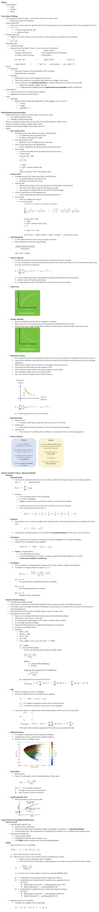

# QunatitativeFinance
Qunatitative Finance

- Python examples for mathematical models concerning the finance.
- Bonds pricing. 
- Markowitz-model. 
- Then Capital Asset Pricing Model (CAPM).
- Black-Scholes model.
- How to eliminate risk with hedging.

